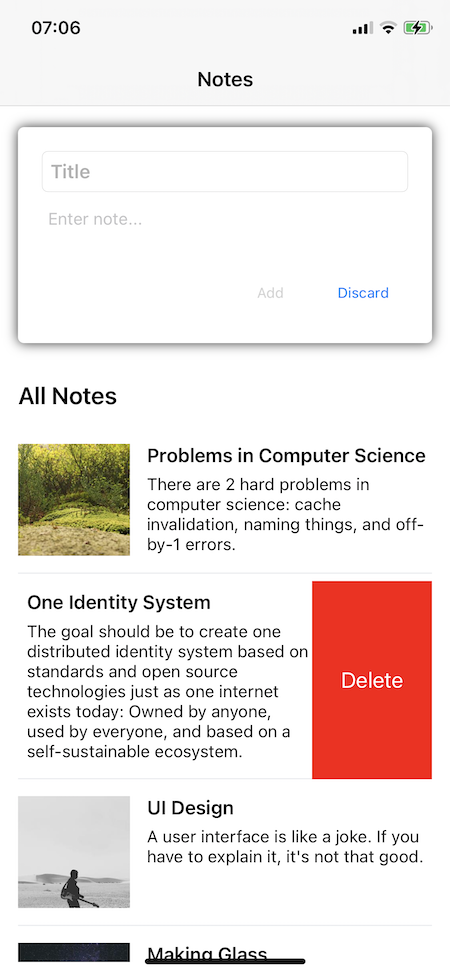

# XamarinNotes
This is a sample Xamarin app. It consists of one page that allows adding notes to a list of notes.
This app is optimized for iOS and tested on an iPhone 12 (iOS 14.1).

## Functionality
- Notes have a title and content
- Random images are added to notes
- "Add" button disabled until title and content are entered
- "Discard" button clears title and content
- Notes can be deleted by swiping them to the left side
- Custom app icon
- Splashscreen (on iOS)
- Sample UI Unit Test
- Sample Unit Test

## Screenshots
### v0.2

### v0.1

## Known Bugs
- On Android the SwipeView, used to implement the delete functionality, causes the app to crash
